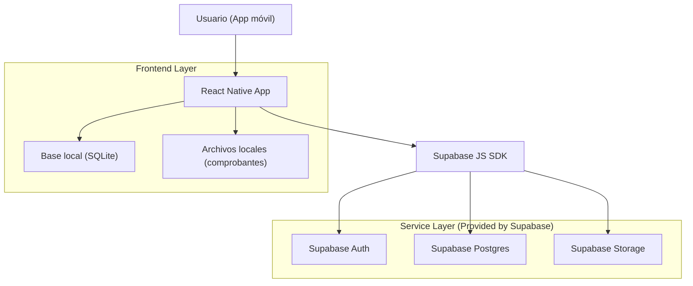
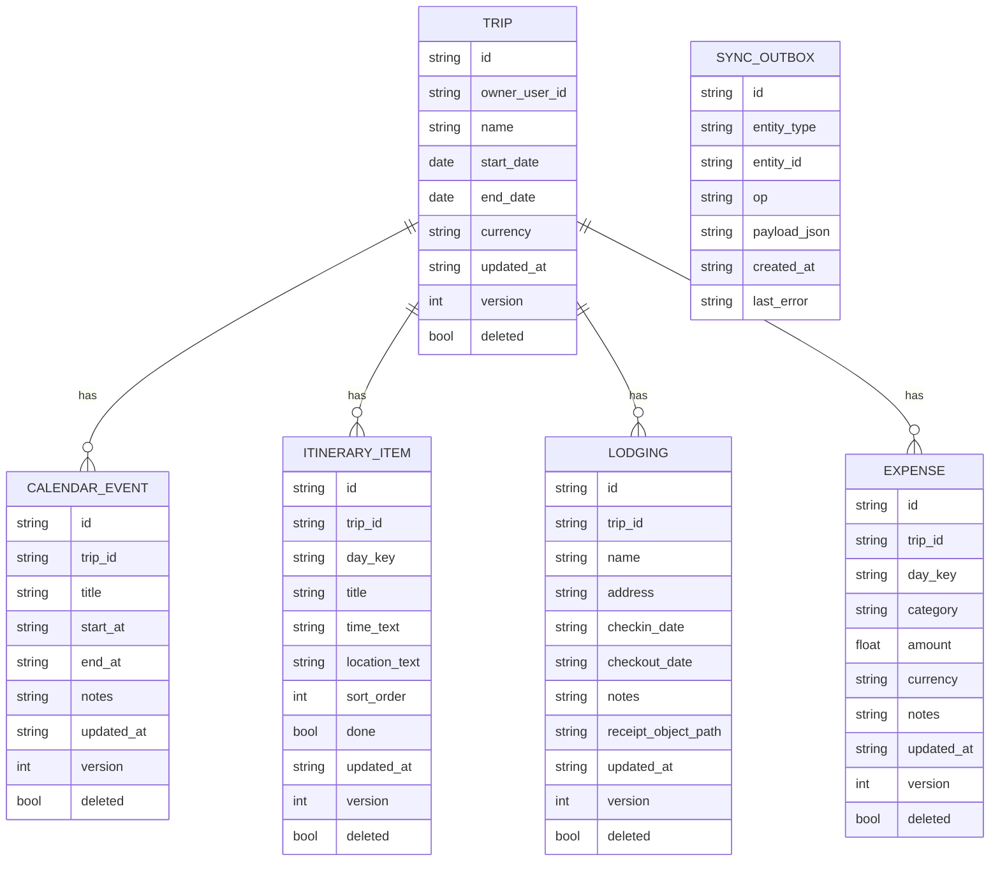

## 1.Architecture design


## 2.Technology Description
- Frontend (mobile): React Native + TypeScript (recomendado Expo si ya usas flujo JS/TS)
- UI: React Navigation (Stack + Tabs), componentes nativos
- Local persistence (offline-first): SQLite (p. ej. expo-sqlite o react-native-sqlite-storage)
- Sync: Supabase JS SDK (Auth + Postgres + Storage)
- Backend: None

## 3.Route definitions
| Route | Purpose |
|-------|---------|
| /auth | Acceso: login/registro/recuperación |
| /trips | Mis viajes: lista, crear/editar, estado de sincronización |
| /trips/:tripId | Detalle de viaje: contenedor con pestañas de módulos |
| /trips/:tripId/calendar | Calendario del viaje |
| /trips/:tripId/itinerary | Itinerario del viaje |
| /trips/:tripId/lodging | Hospedaje del viaje |
| /trips/:tripId/expenses | Gastos del viaje |
| /trips/:tripId/reports | Reportes del viaje |

## 6.Data model(if applicable)

### 6.1 Data model definition


### 6.2 Data Definition Language
Nota: siguiendo una estrategia offline-first, se recomienda:
- Tablas remotas en Supabase (Postgres) equivalentes a las entidades.
- Tablas locales SQLite equivalentes + una cola de salida (outbox) para cambios offline.
- Evitar FKs físicas; usar claves lógicas (trip_id) en aplicación.

Supabase (Postgres) — ejemplo mínimo (remoto)
```
CREATE TABLE trips (
  id UUID PRIMARY KEY DEFAULT gen_random_uuid(),
  owner_user_id UUID NOT NULL,
  name TEXT NOT NULL,
  start_date DATE,
  end_date DATE,
  currency TEXT,
  version INT DEFAULT 1,
  deleted BOOLEAN DEFAULT FALSE,
  updated_at TIMESTAMPTZ DEFAULT NOW()
);

CREATE TABLE expenses (
  id UUID PRIMARY KEY DEFAULT gen_random_uuid(),
  trip_id UUID NOT NULL,
  day_key TEXT,
  category TEXT,
  amount NUMERIC NOT NULL,
  currency TEXT,
  notes TEXT,
  version INT DEFAULT 1,
  deleted BOOLEAN DEFAULT FALSE,
  updated_at TIMESTAMPTZ DEFAULT NOW()
);

-- Permisos (lineamientos típicos)
GRANT SELECT ON trips TO anon;
GRANT ALL PRIVILEGES ON trips TO authenticated;
GRANT SELECT ON expenses TO anon;
GRANT ALL PRIVILEGES ON expenses TO authenticated;
```

SQLite (local) — piezas clave
```
-- tabla espejo local + marcas de sync
CREATE TABLE trips_local (
  id TEXT PRIMARY KEY,
  name TEXT NOT NULL,
  start_date TEXT,
  end_date TEXT,
  currency TEXT,
  version INTEGER DEFAULT 1,
  deleted INTEGER DEFAULT 0,
  updated_at TEXT,
  dirty INTEGER DEFAULT 0
);

-- outbox (cola de cambios offline)
CREATE TABLE sync_outbox (
  id TEXT PRIMARY KEY,
  entity_type TEXT NOT NULL,
  entity_id TEXT NOT NULL,
  op TEXT NOT NULL,
  payload_json TEXT NOT NULL,
  created_at TEXT NOT NULL,
  last_error TEXT
);
```

### Estrategia de sincronización (offline-first)
- Escritura local primero: todo CRUD impacta SQLite y crea un item en `sync_outbox`.
- Sync push: al tener conexión, procesar outbox en orden; por cada item:
  - Upsert en Supabase (por id) y aumentar `version`/`updated_at`.
  - Si hay adjuntos (comprobantes), subir a Supabase Storage y guardar `receipt_object_path`.
- Sync pull: consultar cambios remotos por `updated_at` desde el último checkpoint y aplicar en SQLite.
- Conflictos:
  - Mínimo viable: "última escritura gana" basado en `updated_at`.
  - Recomendado: si `version` remoto > local y local está `dirty`, registrar conflicto y pedir elección al usuario.
