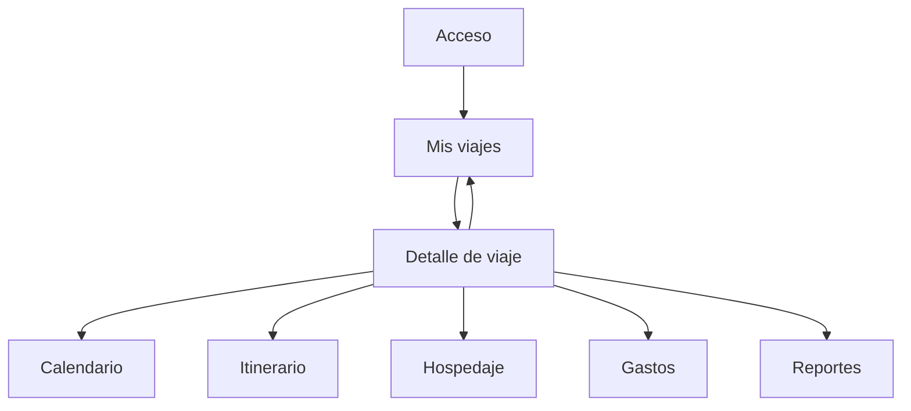

## 1. Product Overview
Migrar la app de viajes a React Native manteniendo una experiencia **offline-first** con sincronización bidireccional con Supabase.
La app permite planificar (calendario/itinerario/hospedaje), controlar gastos y generar reportes, sin depender de conexión.

## 2. Core Features

### 2.1 User Roles
| Rol | Método de registro | Permisos principales |
|------|---------------------|---------------------|
| Viajero | Email + contraseña (Supabase Auth) | Crear/editar viajes, usar módulos offline, sincronizar, exportar reportes |

### 2.2 Feature Module
La app se compone de las siguientes pantallas principales:
1. **Acceso**: iniciar sesión, registrarse, recuperación.
2. **Mis viajes**: lista de viajes, crear viaje, acceso a sincronización básica.
3. **Detalle de viaje**: pestañas para calendario, itinerario, hospedaje, gastos y reportes.

### 2.3 Page Details
| Page Name | Module Name | Feature description |
|-----------|-------------|---------------------|
| Acceso | Inicio de sesión / Registro | Autenticar con Supabase Auth; mantener sesión para uso offline; mostrar estados de conectividad y errores. |
| Mis viajes | Lista de viajes | Mostrar viajes locales; buscar/filtrar básico; abrir detalle; permitir creación/edición offline. |
| Mis viajes | Sincronización | Indicar “Pendiente de sincronizar”; iniciar sync manual; mostrar última sincronización y conflictos si existen. |
| Detalle de viaje | Navegación por módulos | Cambiar entre pestañas (Calendario, Itinerario, Hospedaje, Gastos, Reportes) manteniendo estado local. |
| Detalle de viaje | Calendario | Ver días del viaje; crear/editar eventos/actividades; asociar actividades a fechas; funcionar offline. |
| Detalle de viaje | Itinerario | Crear/editar items (lugar, hora, notas); reordenar; marcar completado; funcionar offline. |
| Detalle de viaje | Hospedaje | Registrar reservas/estancias (nombre, dirección, check-in/out, notas); adjuntar comprobantes si aplica; funcionar offline. |
| Detalle de viaje | Gastos | Registrar gastos (monto, moneda, categoría, fecha, notas); dividir por día/categoría; funcionar offline. |
| Detalle de viaje | Reportes | Generar resumen (totales por categoría/día, comparación presupuesto vs real si existe); exportar/compartir (PDF/CSV) desde el dispositivo. |

## 3. Core Process
**Flujo del Viajero**
1. Inicias sesión (una vez) y la app guarda sesión para permitir uso sin conexión.
2. En “Mis viajes” creas o abres un viaje; todo se guarda primero en almacenamiento local.
3. Dentro del viaje gestionas calendario, itinerario, hospedaje y gastos; cada cambio se marca como “pendiente de sincronizar”.
4. Cuando hay conexión (o bajo acción manual), se sincronizan cambios locales a Supabase y se descargan cambios remotos.
5. Si hay conflicto (mismo registro editado en dos dispositivos), la app te muestra qué versión conservar.
6. Generas reportes y los compartes/exportas desde el móvil.

